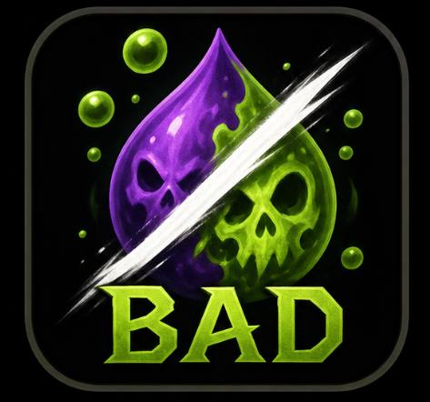

# BAD - Bad Aura Detector



BAD plays a sound when you or someone in your current group, raid, or battleground has a debuff your character can remove.

It is intentionally small: no raid frames, click-casting, priority list, or full dispel UI. It only watches for removable debuffs and alerts you.

## Features

- Detects removable Magic, Curse, Poison, and Disease debuffs based on your class and known spells.
- Monitors your full available group automatically, including party, raid, and battleground units.
- Optional pet monitoring.
- Normal and danger sound selectors, including WeakAuras and PowerAurasMedia sound choices when WeakAuras is installed.
- Sound channel option.
- Minimum interval between sounds to avoid spam.
- Optional chat messages.
- Localized client text for all WoW-supported locales.

## Localization

BAD supports the following WoW client locales:

```text
enUS, enGB, ptBR, deDE, esES, esMX, frFR, itIT, koKR, ruRU, zhCN, zhTW
```

## Commands

```text
/bad config
/bad test
/bad on
/bad off
/bad status
/bad sound next
/bad cooldown 5
/bad chat
/bad debug
/bad combat
```

## Installation

Download `BAD.zip` from the latest GitHub Release and extract it into:

```text
World of Warcraft/_anniversary_/Interface/AddOns/
```

After extraction, the addon folder should be:

```text
World of Warcraft/_anniversary_/Interface/AddOns/BAD/
```

Restart the game or reload the UI.

Do not use GitHub's green **Code > Download ZIP** button for installation. That downloads the source repository snapshot, not the packaged addon.

## Compatibility

- World of Warcraft Classic Anniversary TBC
- Interface: `20505`

## Changelog

See [CHANGELOG.md](CHANGELOG.md).

## Release Packaging

GitHub Releases build an installable `BAD.zip` containing:

```text
BAD/
  BAD.toc
  BAD.lua
```

BAD does not redistribute Decursive or WeakAuras audio files. It references those addon sound paths when they are installed. The sound list only includes media shipped by WeakAuras itself, not sounds registered by other addons through LibSharedMedia.

The sound channel setting uses the game's audio channels. Alert volume is controlled by the selected channel in the game's audio settings.
